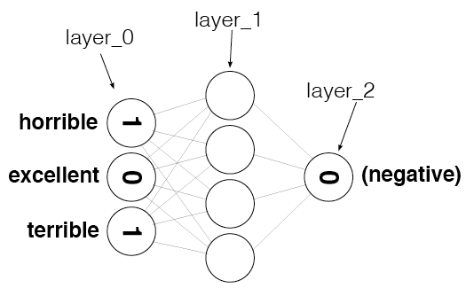
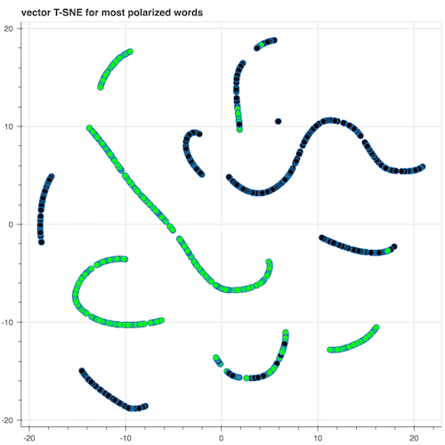

# Sentiment Classification

### Introduction
This project we implements a Neuron Network (NN) for sentiment understanding from film reviews. Key word from reviews are used for Labels of 'positive' and 'negative' reviews are provided for training. 

### Architecture

The NN consists of one input layer the node of which are the vocabulary extracted from the reviews, one hiddedn layer and a output layer whose node is 1(0) representing a "Positive(Negative)" review. 

### Steps 

The project is broken into several mini projects to resolve the problem step by step. Details can be found in the [notebook](./Sentiment_Classification_Projects.ipynb)

Mini-Project 1: In this project we started by curating dataset and developing a predictive theory fo we thought the NN could be able to identify the correlation between the input and output data. We then validate the theory using some simple count based heuristics and found that we are able to identify words with both positive and negative correlation to out output data

Mini-Project 2: In this project, we created the input and output data for training the NN.  

Mini-Project 3: In this project, we trained a NN with the vocabulary prepared from project 2, the NN was only barely to find the correlation, with accuracy of 60% and 100 reviews per second, truggling to cut through the noise. 

Mini-project 4 through 6: In these projects we seeks to increase the meaning signal and reduce the noise in dataset. We did so by reducing inefficientcies in the Network by only forward propagating and updating weights for nonzero inputs as well as only using word with large postive to negative ratio

In the end, our final network is able to classify at an accuracy level of 86% and 7000 reviews per second. Additionally, the final trained weights can also be used to cluster the sentiment as shown in the figure below in which green points are word with positive sentiment and black are the words with negative sentiment

